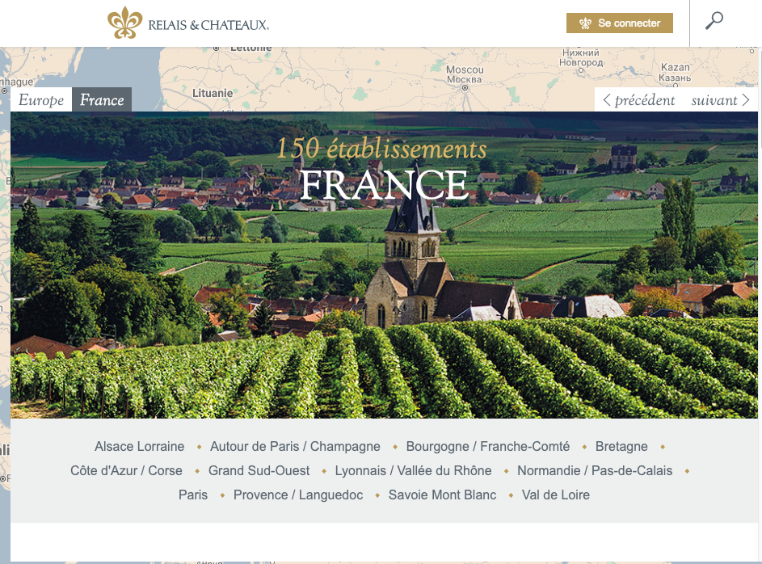
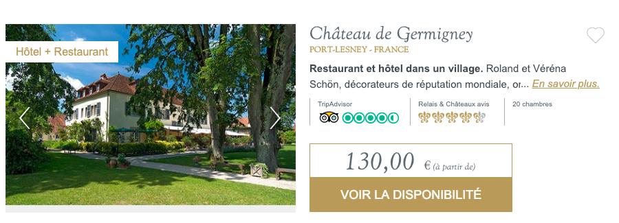
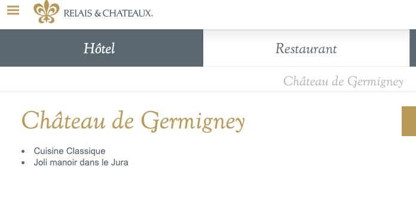
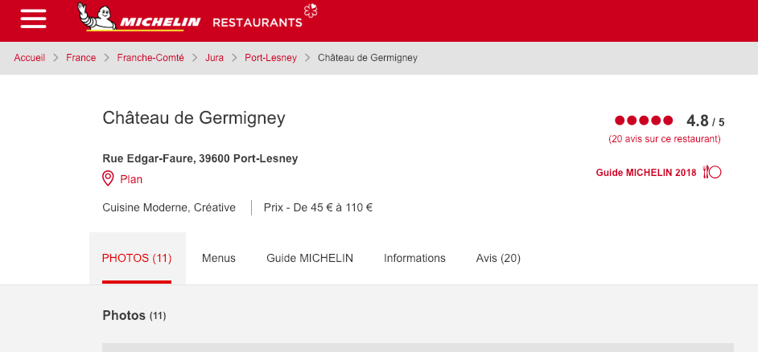
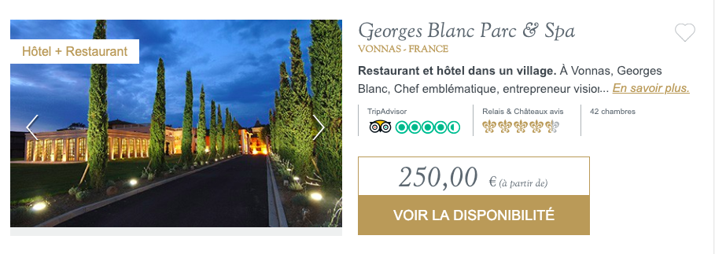
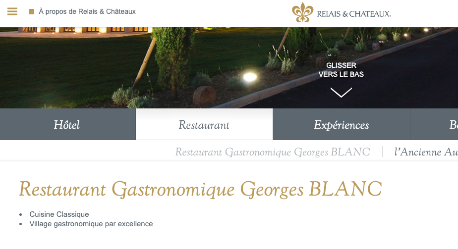
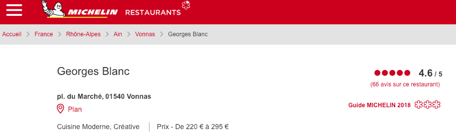
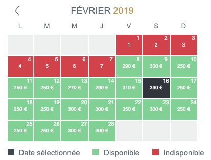
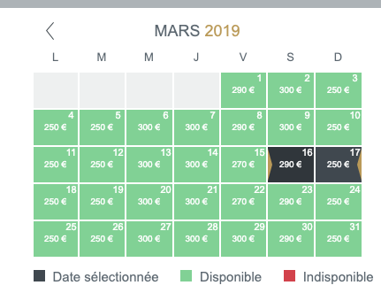

---

1 wish in 2019

---

😴

Sleep

---

Sleep well

---

Just 1 night

---

Quiet

(_OKLM_)

---


---


---


---

to spread its unique art de vivre across the globe

---

by selecting outstanding properties


---

🏰

with a truly unique character

---

Hotel + Restaurant

---



---



---



---



---



---



---



---



---



---

⏱️

Time consuming

---

Help me with a Web Application

---

🎯 List the best rates for each Weekend for France located Relais & Châteaux


---

with starred restaurant.

---

Stack

```
Node.js + React
+ Material Design (mdl, bootstrap, foundation...)
+ JavaScript ES6
[+ docker + redis ...]
```

---

Good Luck.

See you in 3 weeks.

---

🏃‍♀️ Steps to do

---

## [92bondstreet/castle](https://github.com/92bondstreet/castle)

---

🕵️‍♀️

Investigation

---

How it works?

---

Relais & Châteaux

---

1. How it works [relaischateaux.com](https://www.relaischateaux.com)
2. How to get the list of Hotel + restaurant

---

3. How to get the price for a given Weekend
...
---

Michelin Restaurant

---

1. How it works [restaurant.michelin.fr](https://restaurant.michelin.fr)
2. How to get the list of starred restaurant

---

3. What are the given properties for a starred restaurant: name, adress, town, stars, chef... ?
...

---

The web application

---

How to create a link between Relais & Châteaux and the starred restaurant?

---

⌨️

Server-side with Node.js

---

Create a module called `castle`

---

that returns the list of best rate for all Weekends for each Hotel

---

```js
const castle = require('castle');
...
const restaurant = {...};


castle.getHotels();
castle.getPrices(restaurant);

...

```

---

1. create the calls (api, http) to get the hotel page
1. check if the restaurant is starred.

---

1. get the restaurant name (by scraping or decoding api response)

---

1. get the price by Weekend (by scraping or decoding api response)

etc ...

---

Create a module called `michelin`

---

that returns the list of starred restaurants

---

```js
const michelin = require('michelin');

michelin.get();
```

---

1. scrape list of France located starred restaurants

---

1. store the list into JSON file, nosql database (like redis, mongodb...)

---

1. create a node module that returns this list

etc...

---

Client-side with React

---

Later

---

MVP

---

For each Weekend, list best rates for France located Relais & Châteaux with ⭐

---

* filtering by name
* sorting by stars
* sorting by price
* sorting by distance
...

---

👩‍💻 Just tell me what to do

---

* Fork the project via `github`

---

* Clone the project

---

* Commit early, commit often, push often
